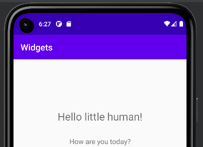
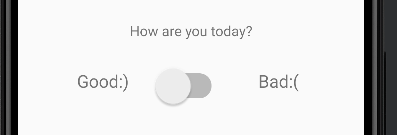
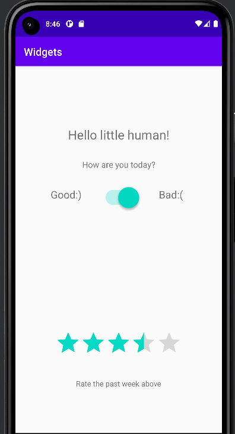

# Rapport - Widgets 

Denna rapport innehåller kortfattad beskrivning av arbetssättet för skapande och tillägg av widgets och constraints. 

Den typ av layout som har valts är ConstraintLayout. Redigeringen till ContraintLayout sker i filen activity_main.xml, och kan ses i koden
nedan där <androidx.constraintlayout.widget.ConstraintLayout finns som både start och sluttagg. Ellipsis representerar de widget element som finns
inom Layouten, till exempel som TextView, RatingBar och Switch. 

    <?xml version="1.0" encoding="utf-8"?>
    <androidx.constraintlayout.widget.ConstraintLayout xmlns:android="http://schemas.android.com/apk/res/android"
    ...
    </androidx.constraintlayout.widget.ConstraintLayout>

Ett utav de element som har tillagts är ett TextView element. Med detta kan text skrivas som sedan presenteras på sidan.
Med hjälp av android:text="Hello little human!" är det denna text som blir synlig på appen. Nedanstående kod
har skrivits i activity_main.xml, där alla förändringar och tillägg i samband med design och layout har gjorts.
android:textSize styr över textens storlek, och app:layout_constraint bestämmer hur constrainen ska ligga. I detta
fall ligger alla sidor i TextView elementet "kant i kant" med ConstraintLayout elementet eftersom att detta är parent. 

    <TextView
        ...
        android:text="Hello little human!"
        android:textSize="24sp"
        app:layout_constraintBottom_toBottomOf="parent"
        app:layout_constraintLeft_toLeftOf="parent"
        app:layout_constraintRight_toRightOf="parent"
        app:layout_constraintTop_toTopOf="parent"
        .../>

Resultatet för denna TextView finns nedan:

I den andra TextView finns texten "How are you today?" som har skapats på samma sätt som tidigare TextView element (android:text=). 
Constraints till detta element beskriver här att det skall vara kant till kant som parent-elementet (ConstraintLayout). Kodsnutten säger
dock att toppen av denna TextView ska vara i bottnen på det element med id textView, som är föregående TextView "Hello little human". Hur 
dessa TextViews förhåller sig till varandra kan ses i bilden ovan. 

        <TextView
        android:id="@+id/textView2"
        ...
        android:text="How are you today?"
        android:textSize="16sp"
        app:layout_constraintBottom_toBottomOf="parent"
        app:layout_constraintEnd_toEndOf="parent"
        app:layout_constraintStart_toStartOf="parent"
        app:layout_constraintTop_toBottomOf="@+id/textView" 
        .../>
        

Ännu ett av de element som har lagts till är Switch. Liknande föregående komponenter har även Switch constraints kant i kant med förälder-elementet.
app:layout_constraintTop_toBottomOf="@+id/textView2" innebär att toppen på Switch ska vara i botten av elementet med id textView2, vilket är Textview "How are you today". 
Ännu en skillnad värt att nämna för denna kodsnutt gällande designen är scaleX och scaleY som nedan säger att elementet ska vara dubbelt så stort i båda axlar. 

    <Switch
        android:id="@+id/switch1"
        ...
        android:scaleX="2"
        android:scaleY="2"
        app:layout_constraintBottom_toBottomOf="parent"
        app:layout_constraintEnd_toEndOf="parent"
        ...
        app:layout_constraintStart_toStartOf="parent"
        app:layout_constraintTop_toBottomOf="@+id/textView2"
        .../> 

För att switch ska kunna uppfylla en funktion har två ytterligare TextView element lagts till. Dessa har placerats med contraints till parent elementet men även till elementet switch. Användaren kan alltså trycka på switch för att indikera
ifall en mår bra eller dåligt. I den nedanstående koden visar eventuella constraints och margins som finns. Contraints är kopplade till parent elementet som är ConstraintLayout och har i detta fall en constraint till 
start av switch elementet (dess vänstra sida). 

    <TextView
     ...
        android:layout_marginLeft="20dp"
        android:layout_marginBottom="210dp"
        android:text="Good:)"
        android:textSize="20sp"
        app:layout_constraintBottom_toBottomOf="parent"
        app:layout_constraintEnd_toStartOf="@+id/switch1"
        .../>

Med kodsnutten nedan visas texten "Bad:(" på webbsidan. Med hjälp av margins finns 20dp till höger om elementet och 210dp nedåt. 

    <TextView
    ...
        android:layout_marginRight="20dp"
        android:layout_marginBottom="210dp"
        android:text="Bad:("
        android:textSize="20sp"
        app:layout_constraintBottom_toBottomOf="parent"
        app:layout_constraintEnd_toEndOf="parent"
        app:layout_constraintStart_toEndOf="@+id/switch1"
        app:layout_constraintTop_toTopOf="parent" />

Nedan finns en bild som presenterar switch samt textview element där texten är "Good" och "Bad". 

Ratingbar används på sidan i kombination med en TextView som frågar användaren att ranka den senaste veckan. Constraints finns i samband med förälder-elementet, där ovansidan av ratingbaren har en constraint till switch elementet. 
Det finns även en margin mellan switch och ratingbar elementet på 100dp. 

    <RatingBar
    ...
        app:layout_constraintBottom_toBottomOf="parent"
        app:layout_constraintEnd_toEndOf="parent"
        app:layout_constraintStart_toStartOf="parent"
        app:layout_constraintTop_toBottomOf="@+id/switch1"
        android:layout_marginTop="100dp"
        android:contentDescription="Rating of past week"/>

    <TextView
    ...
        android:text="Rate the past week above"
    ...
    />

Det slutgiltiga resultatet kan ses nedan som visar en helbild av applikationen.

,,](android.png)

